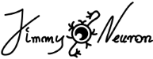

#  

## Simple Neural-Network library for c++
Library is still under development

## Features
This librarty support easy to use and modify alorythyms.

### Activation functions
Libray has some Transrer Functions built in, such as tanh, sigmoid, linear, reLU and softmax.
But you are also able to create and add your own

### Learning algorythyms
Library supports Back Propagation algorythym and critic learning.

## Implementation
### CMake
    # include directoy
    add_subdirectory(JimmyNeuron)

    # link to your projsct
    add_executable(project_name program.cpp)
    target_link_libraries(project_name PUBLIC
        Jimmy
    )
### Simple program example
    #include <iostream>
    #include <JimmyNeuron/Jimmy.hpp>

    int main(){
        // defying how many neurons will be craerted in each layer
        std::vector<int> topology{2,10,1}; 

        // creates Net instance
        Jimmy::Net mynet(topology, Jimmy::Methods::transFuncs::linear, Jimmy::Methods::lossFuncs::rmse, 0.01);

        // defying inputs, and desired outputs
        vector<double> inp = {0, 0};
        vector<double> prop = {0};

        // passing inputs and desired outputs for network to learn 
        mynet.feedForward(inp);
        mynet.backProp(prop);

        // get outputs n-th output neuron and loss of the net
        cout << "result:" << mynet.getResult(0) << "\tloss: " << mynet.getLoss() <<'\n';
    }

### Other examples
    // create new type of TransferFunction
    double foo(double weightedSum) //{ return some formula;}
    double derivativeFoo(double weightedSum, double fooOutput) //{ return some derivative formula;}

    //create instance of a new TransferFunctionM
    const TransferFunction(foo, derivativeFoo);

## Technologies

1. Uses cmake, to meake it easier to compile
2. This library needs SFML library to be placed in "src/" directory (at this moment) https://github.com/SFML/SFML

###### Artificial neural network by Cookie Core 

